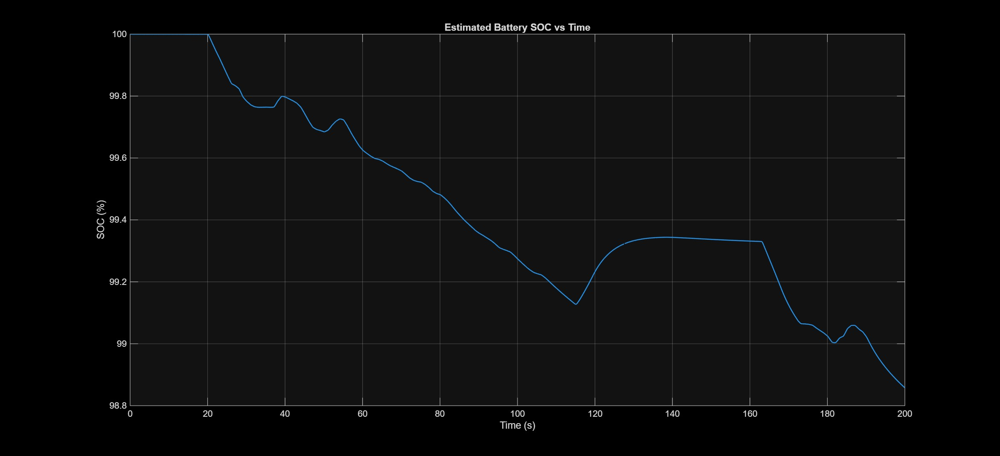

# 🚗 Electric Vehicle Powertrain Performance Analysis using MATLAB/Simulink

## 📌 Overview

This project presents the modeling, simulation, and performance analysis of an Electric Vehicle (EV) powertrain using MATLAB/Simulink and Simscape.

During my internship, we first learned the fundamentals of Electric Vehicle powertrain systems and MATLAB/Simulink-based modeling. After understanding the architecture, we were assigned an EV powertrain simulation project.

I worked on the complete EV powertrain model consisting of a Battery, PWM-controlled H-Bridge, DC Motor, Gearbox, Longitudinal Driver, and Vehicle Body. I further enhanced the project by integrating battery voltage and current sensing and developing a MATLAB-based analysis workflow to estimate battery State of Charge (SOC), battery power, energy consumption, regenerative energy, and overall EV efficiency.

---

# 🎯 Objectives

- Model an Electric Vehicle powertrain using MATLAB/Simulink
- Simulate vehicle operation using the FTP-75 drive cycle
- Understand EV energy flow
- Estimate Battery State of Charge (SOC)
- Analyze battery voltage and current
- Calculate battery power and energy consumption
- Study regenerative braking
- Evaluate vehicle efficiency (Wh/km)

---

# 🏗 EV Powertrain Architecture

The complete EV powertrain consists of:

- Battery
- PWM Controller
- H-Bridge
- DC Motor
- Gearbox
- Vehicle Body
- Longitudinal Driver
- FTP-75 Drive Cycle

**Complete Model**

---

# ⚙ Powertrain Components

| Component | Function |
|-----------|----------|
| Battery | Supplies electrical energy to the vehicle |
| PWM Controller | Controls motor voltage by varying duty cycle |
| H-Bridge | Controls motor voltage and direction |
| DC Motor | Converts electrical energy into mechanical torque |
| Gearbox | Increases wheel torque |
| Vehicle Body | Simulates vehicle dynamics |
| Longitudinal Driver | Tracks the FTP-75 reference speed |

---

# ⭐ My Contributions

During this internship project, my contributions included:

- Studied EV powertrain architecture.
- Simulated the complete EV powertrain model.
- Integrated battery voltage sensing.
- Integrated battery current sensing.
- Developed a MATLAB script for battery performance analysis.
- Estimated Battery State of Charge (SOC) using Coulomb Counting.
- Calculated battery power.
- Calculated energy drawn.
- Calculated regenerated energy.
- Calculated net energy consumption.
- Calculated vehicle efficiency (Wh/km).
- Evaluated regenerative braking performance.

---

# 🔋 Battery Performance Analysis

The battery analysis was performed using MATLAB after simulation.

The following parameters were calculated:

- Battery Voltage
- Battery Current
- Battery Power
- State of Charge (SOC)
- Energy Drawn
- Regenerated Energy
- Net Energy Consumption
- Energy Consumption (Wh/km)

Battery Power was calculated as:

Power = Voltage × Current

SOC was estimated using the Coulomb Counting method.

---

# 📊 Simulation Results

| Parameter | Value |
|-----------|---------:|
| Initial SOC | 100 % |
| Final SOC | 98.86 % |
| SOC Reduction | 1.14 % |
| Energy Drawn | 929.52 Wh |
| Regenerated Energy | 134.43 Wh |
| Net Energy Consumed | 795.10 Wh |
| Regenerative Recovery | 14.46 % |
| Distance Travelled | 1.463 km |
| Peak Battery Voltage | 730.88 V |
| Peak Battery Current | 115.44 A |
| Peak Battery Power | 84.37 kW |

---

# 📈 Simulation Outputs

## Battery Voltage

---

## Battery Current

---

## Battery Power

---

## Estimated Battery SOC

---

## MATLAB Results

---

# 📌 Key Findings

- Successfully modeled an EV powertrain using MATLAB/Simulink.
- Simulated vehicle operation under the FTP-75 drive cycle.
- Estimated Battery SOC using Coulomb Counting.
- Calculated battery power and energy consumption.
- Evaluated vehicle efficiency using Wh/km.
- Observed regenerative braking with approximately **14.46% energy recovery**.
- Analyzed battery electrical performance through MATLAB post-processing.

---

# 🛠 Tools Used

- MATLAB R2025b
- Simulink
- Simscape Electrical
- MATLAB Scripting

---

# 💻 Skills Demonstrated

- MATLAB Programming
- Simulink Modeling
- Simscape Electrical
- Electric Vehicle Powertrain
- Battery Analysis
- State of Charge (SOC) Estimation
- Regenerative Braking Analysis
- Engineering Simulation

---

# 🚀 Future Improvements

- Replace the DC Motor with a PMSM motor.
- Integrate a Battery Management System (BMS).
- Add battery thermal modeling.
- Compare multiple drive cycles.
- Implement advanced motor control algorithms.

---

# 👨‍💻 Author

**Rohit Singh**

B.Tech. Electrical and Electronics Engineering

National Institute of Technology Karnataka (NITK), Surathkal
